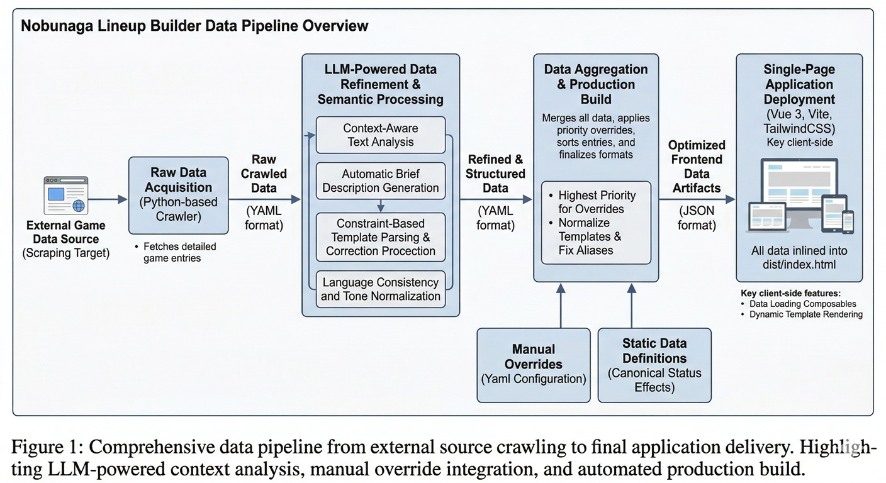

# Nobunaga Lineup Builder

**信長之野望：真戰** 編隊工具 — 從 game8.jp 爬取武將/戰法資料，透過 LLM 翻譯為繁體中文，並提供互動式編隊介面。

## Pipeline 總覽



## 功能

- 137+ 位武將資料（數值、特性、技能、頭像）
- 196+ 個戰法翻譯（日文 → 繁體中文），含模板化數值顯示
- 29 種狀態效果定義
- 互動式編隊器（5 隊編制，主將/副將配置）
- 武將庫（依 Cost / 勢力多選篩選）
- 戰法庫（依類型 / 稀有度篩選）
- 庫存管理（標記已擁有武將/戰法）
- Override 機制（手動新增未上架武將/戰法）

## 快速開始

### 環境需求

- Python 3.10+
- Node.js 20+
- [Gemini CLI](https://github.com/google-gemini/gemini-cli)（LLM 翻譯用）

### 安裝

```bash
npm install
pip install pyyaml beautifulsoup4 requests tqdm python-dotenv
```

### 設定

```bash
cp .env.example .env
# 填入 GOOGLE_CLOUD_PROJECT（Gemini API 用）
```

### 開發

```bash
npm run dev        # 建構資料 + 啟動開發伺服器
```

### 生產建構

```bash
npm run build      # 建構資料 + Vite 生產建構 → dist/index.html（單檔 SPA）
```

## 資料 Pipeline

### 1. 爬蟲

```bash
python3 script/crawl_heroes.py --detail              # 完整爬取
python3 script/crawl_heroes.py --detail --limit 5     # 測試 5 位
python3 script/crawl_heroes.py --detail --name 信長    # 篩選名稱
```

### 2. LLM 翻譯

```bash
python3 script/llm_translate.py --batch-size 5        # 翻譯全部（技能+特性+武將名）
python3 script/llm_translate.py --skills --force       # 強制重翻技能
python3 script/llm_translate.py --heroes               # 僅翻譯武將名稱
```

### 3. 手動 Override

```bash
python3 script/override.py                            # 互動式選單
python3 script/override.py --quick-add                # 自然語言快速新增戰法
python3 script/override.py --add-hero                 # 新增武將
python3 script/override.py --modify-skill             # 修改既有戰法
```

### 4. 建構前端資料

```bash
npm run data       # build_frontend_data.py + check_data_integrity.py
```

## 專案結構

```
script/
  crawl_heroes.py          # 網頁爬蟲（game8.jp）
  llm_translate.py         # Gemini 批次翻譯
  llm_core.py              # LLM 共用基礎設施（prompt、API、快取）
  build_frontend_data.py   # YAML → JSON 建構 + 後處理
  check_data_integrity.py  # 資料完整性驗證
  override.py              # 互動式 Override CLI

data/
  overrides.yaml           # 手動覆蓋資料（git 追蹤）
  statuses.yaml            # 狀態效果定義（git 追蹤）
  *_crawled.yaml           # 爬蟲輸出（gitignored）
  *_translated.yaml        # LLM 翻譯輸出（gitignored）

src/
  components/              # Vue 元件
  composables/             # Vue 組合式函數
  main.ts                  # 應用程式入口

.build/                    # 前端 JSON（gitignored）
dist/                      # Vite 產出（gitignored）
```

## 技術棧

- **前端**: Vue 3 + Element Plus + TailwindCSS + Vite
- **後端 Pipeline**: Python + PyYAML + BeautifulSoup4
- **LLM**: Gemini CLI（Flash/Pro 模型）
- **部署**: 單檔 SPA（`vite-plugin-singlefile`）

## Acknowledgements

- [Claude Code](https://claude.ai/claude-code) — 架構設計、Pipeline 開發、前端實作
- [Gemini CLI](https://github.com/google-gemini/gemini-cli) — 日文→繁中批次翻譯、戰法結構化提取

## Disclaimer

This project is a fan-made tool for **信長之野望：真戰** (Nobunaga's Ambition: Shinsei). Game data, images, and trademarks belong to their respective owners (KOEI TECMO Games Co., Ltd.). This project is not affiliated with or endorsed by KOEI TECMO.

若本專案之內容侵犯了您的權益，請透過 yt.neko.vision@gmail.com 或 Discord（neko.vision）聯繫作者，將盡速配合處理（包括但不限於移除相關內容或下架本專案）。

## License

[MIT License](LICENSE)
